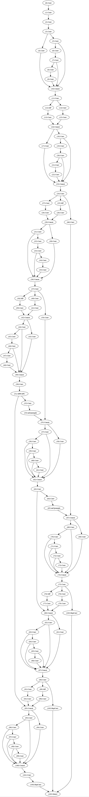

# yolo2dot

A visualizing tool to plot model architecture graph for YOLO .yaml files.


## Installation

This program can be installed using `cargo` from Rust toolchain. You
can visit [rustup.rs](https://rustup.rs/) to install Rust toolchain.

```bash
cargo install yolo2dot
```


## Usage

1. Download the model description file `yolov7.yaml` from the yolov7
   repository
   [here](https://github.com/WongKinYiu/yolov7/tree/v0.1/cfg/deploy).

2. Run `yolo2dot` to create the .dot file.

  ```bash
  yolo2dot yolov7.yaml yolov7.dot
  ```

3. Generate the image file using GraphViz's `dot` command.

  ```bash
  dot -Tjpg yolov7.dot > yolov7.jpg
  ```


## Showreel

| YOLOv7 for Training             | YOLOv7 for Deployment            |
|:-------------------------------:|:--------------------------------:|
|  |  |


## License

This project is distributed under MIT license. Please check the
[LICENSE.txt](LICENSE.txt) file.
